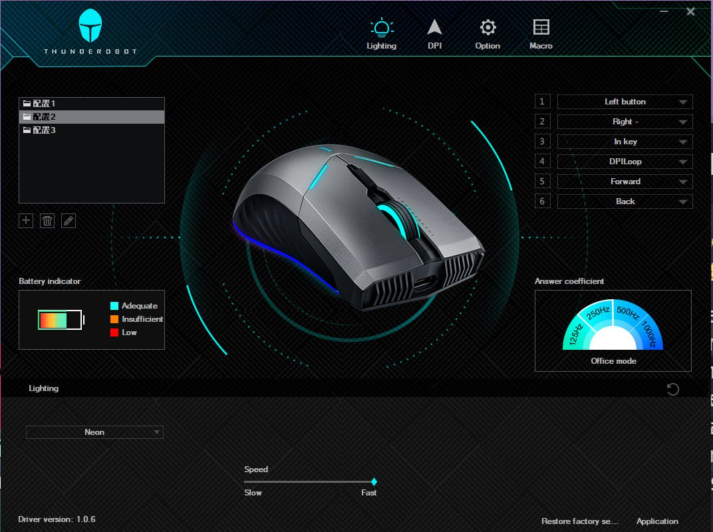
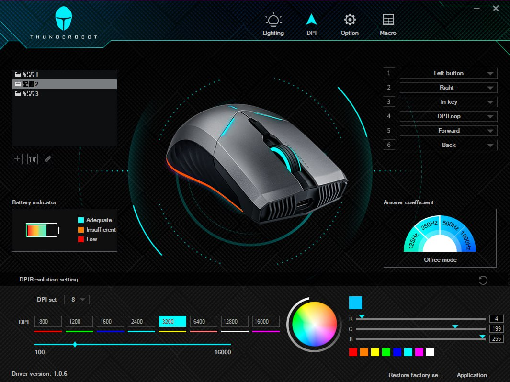
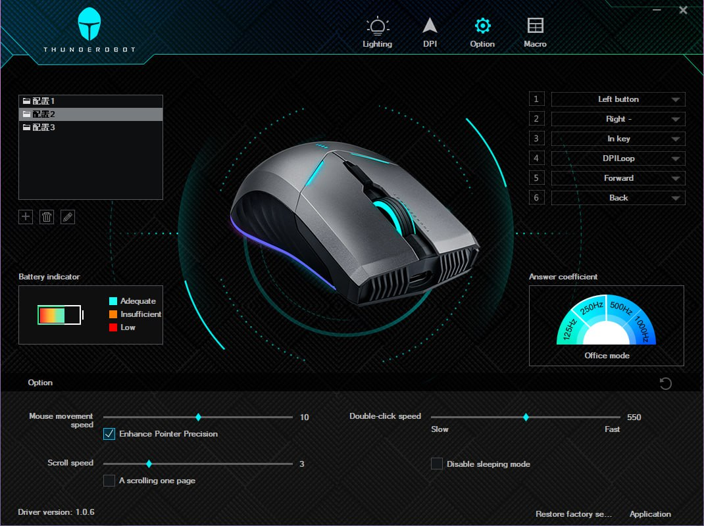
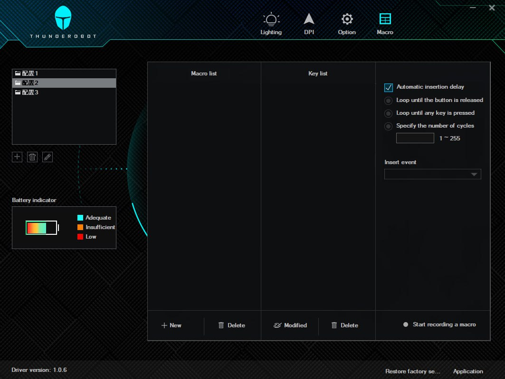

# Thunderobot ML703 Driver guide

Guide for installing and translating the driver of Thunderobot ML703 driver.

## Mouse info

* Buy link: [aliexpress](https://aliexpress.ru/item/1005002361372571.html)
* Official website: https://www.thunderobot.com/

## Installing driver

* link for drivers: https://www.thunderobot.com/service/download

#### Guide for downloading driver

Use Google Chrome and built-in language translator.

## Interface translation and localization

  
English UI

  
  
  
  
  

Thanks to the manufacturer - they moved all text data to `text.xml` file. So you can translate it using any online service like Google or Yandex translator - or even ChatGPT.

* Go to drivers folder (`C:\Program Files (x86)\ML703 Gaming Mouse`)
* copy and backup original text file to another folder
* close the app from tray
* replace the `text.xml` with your language file:
    * [original CN text.xml](text_files/cn/text_cn.xml)
    * [english version of UI - text.xml](text_files/en/text_en.xml)
    * [russian version of UI - text.xml](text_files/ru/text_ru.xml)

**Don't forget to rename file to `text.xml` and replace it inside of installation folder** 
